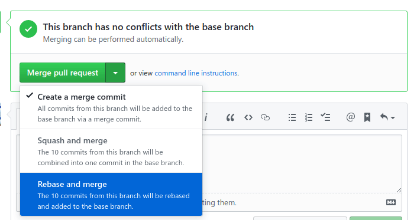

# Frontend Project

The frontend project consists of three apps， `admin-app`, `course-app` & `proans-app`.
They are both generated by vue-cli 4.x.

## App Structure

Currently, what should we concern about is the `src` & `tests` folder.

The `src` containes router, vuex, components, views and the `App.vue`.
Generally, we just write some components and pull them together to make a view.

The `tests` are used to write some unit test files to check if our code is right or not.

## Collaboration

### Git

** 前端组请看 frontend 中的文档进行操作 **

We are using **Git** to manage our code. To contribute your own code, you are supposed to obey the follwing requirements:

1. First of all, fork the repo into your own repository. 
2. Clone your repo forked just now and add remote repo named upstream
    ```shell
    git clone git@github.com:<username>/USTC-SE-2020.git
    git remote add upstream https://github.com/L-JIN/USTC-SE-2020.git
    ```
3. You could create a **dev** branch locally to start your development. But before that, make sure your **frontend** branch is up to date with the **upstream's** frontend branch.
    ```shell
    (master)   $ git checkout -b frontend
    (frontend) $ git pull upstream frontend
    (frontend) $ git checkout dev # suppose you have created dev branch
    ```
4. When you finish your tasks, you may want to merge **dev** into  **master** branch with no-fast-forward mode. Before doing so, sync master with upstream barch.
    ```shell
    (frontend) $ git pull upstream frontend
    (frontend) $ git checkout dev
    (dev)      $ git rebase frontend
    (dev)      $ git checkout frontend
    (frontend) $ git merge dev
    ```
    Then, push it to your own remote repo:
    ```shell
    (frontend) $ git push origin frontend
    ```
5. After your code has been push *origin* master, click http://github.com/ to view your code. You can now make a **pull request** just by click the **new pull request** button. If you think that your code has no negetive effects on frontend, click `Rebase and merge` button. 
    
    


Have fun with Git and make a difference. :)

### Namespace

Every one is assigned some components to finish. **You'd better not change the component belongs to others**.
If a component can be divided into some small components, you should create a folder named `<TheComponentName>` using **Upper Camel Case**, and put the small components into the folder you have created.

## Docker

We can easily development & deployment our app with docker. Here is a shell batch `dockerrun.sh` that simplify our work. To start a docker container, just run the flowing commands:
```shell
chmod u+x dockerrun.sh
dockerrun course-app
```
Now that we can visit `http://localhost:${port}` to do other work.
> Different app has different port assigned, see detail in file `dockerrun.sh`.

## Bugs

when you run `yarn` to init the apps, you will probably get following message:

```shell
⠋  Running completion hooks...error: Unexpected use of file extension "js" for "./plugins/element.js" (import/extensions) at src/main.js:5:8:
  3 | import router from './router';
  4 | import store from './store';
> 5 | import './plugins/element.js';
    |        ^
  6 | 
  7 | Vue.config.productionTip = false;
  8 | 
```

Changing line 5 to `import './plugins/element'` will help you out.
